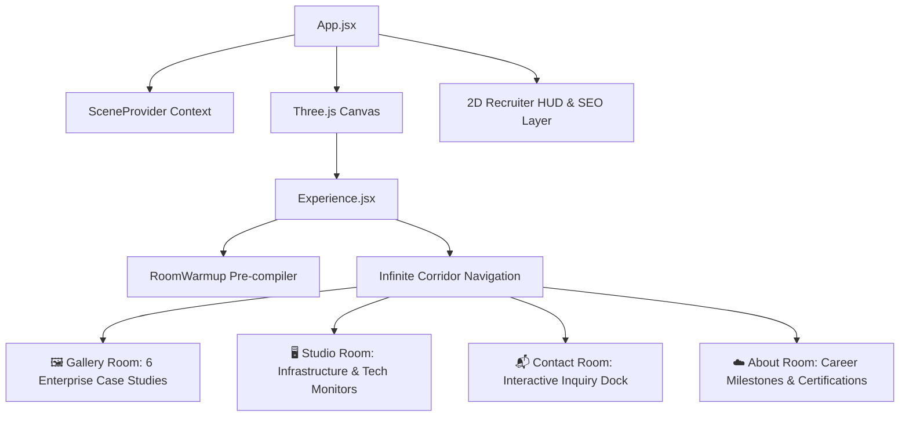

# 🌐 Saurya Janbandhu | 3D Systems Engineering Portfolio

<div align="center">
  
  
  
  
  
</div>

<br/>

Interactive 3D WebGL portfolio for **Saurya Janbandhu**, Senior System Engineer and Modern Workplace specialist based in New Zealand (Timaru / Dunedin). 

The portfolio presents enterprise infrastructure migrations, Microsoft Intune & Entra ID deployments, Fortinet cybersecurity hardening, and PowerShell automation through an infinite corridor and 4 themed interactive 3D rooms.

---

## 🏗️ 3D Experience Architecture



---

## 📁 Data Layer Architecture

The site uses a zero-dependency, strongly-typed **Local Data Store** located in `src/data/`:
- **[`src/data/profile.js`](src/data/profile.js)**: Bio, career work history (Focus Technology Group, CodeBlue, DTSL), academic qualifications, and Microsoft & Fortinet certifications.
- **[`src/data/projects.js`](src/data/projects.js)**: 6 core enterprise engineering case studies (25-Tenant Intune Rollout, Entra ID Zero Trust, Exchange & SharePoint Migrations, Fortinet HA, Clustered Hyper-V/ESXi).
- **[`src/data/studioContent.js`](src/data/studioContent.js)**: Modern workplace guides and technical architecture articles.
- **[`src/data/awards.js`](src/data/awards.js)**: Microsoft MD-102, SC-500, Fortinet NSE 1, and academic credentials.

---

## 🛠️ Local Development

1. **Install dependencies:**
   ```bash
   npm install
   ```

2. **Start the local development server:**
   ```bash
   npm run dev
   ```

3. **Build for production:**
   ```bash
   npm run build
   ```

4. **Preview the production bundle:**
   ```bash
   npm run preview
   ```

---

## 📬 Contact Information

- **Name**: Saurya Janbandhu
- **Email**: [jsaurya101@gmail.com](mailto:jsaurya101@gmail.com)
- **Phone**: 028 8514 7790 (+64 28 8514 7790)
- **Location**: Timaru / Dunedin, New Zealand
- **Status**: Valid New Zealand Resident Visa (Full Work Authorization)
